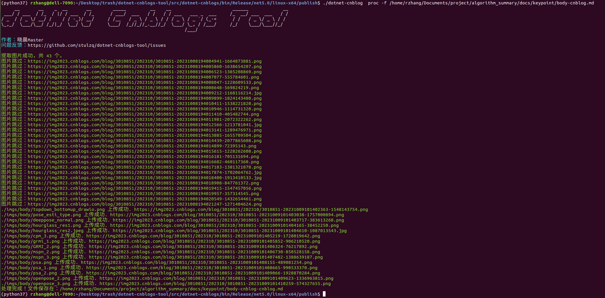

# dotNet 博客园工具 

[](https://www.nuget.org/packages/dotnet-cnblog)

## 一.前言

`工欲善其事必先利其器`，该工具是个十分好用的利器， 源repo[地址](https://github.com/stulzq/dotnet-cnblogs-tool), 详细介绍见[readme](./README_old.md)。
由于dotnet-cnblog目前仅支持markdown中的 ``语法， 不支持html中的img-src语法， 所以本人在其基础上添加新的正则匹配， 增传markdown中的src所对应的图片。

## 二.安装工具
- 如果环境之中有了.Net工具则跳过该步骤
- ubuntu18.04安装dotnet-sdk
- reference： https://learn.microsoft.com/zh-cn/dotnet/core/install/linux-ubuntu-1804

    ```bash
    wget https://packages.microsoft.com/config/ubuntu/18.04/packages-microsoft-prod.deb -O packages-microsoft-prod.deb
    sudo dpkg -i packages-microsoft-prod.deb
    rm packages-microsoft-prod.deb

    sudo apt-get update && \
    sudo apt-get install -y dotnet-sdk-7.0
    ```

## 三.修改与发布
- 具体修改参见[ImageHandler.cs](src/dotnet-cnblogs/TagHandlers/ImageHandler.cs)， 
- 发布二进制文件
    ```bash
    dotnet publish -c Release -r linux-x64 -p:PublishSingleFile=true -p:PublishTrimmed=true -p:IsTrimmable=true -p:TrimMode=link  --self-contained true
    ```
## 四.配置账号
- 这里无需修改，具体操作见[readme](./README_old.md)

## 五.上传图片

- 对Markdown文件里的图片进行解析，上传到博客园，并且转换内容保存到新的文件中。

    ````shell
    dotnet-cnblog proc -f <markdown文件路径>
    ````
    

- 处理过的内容保存在 `Markdown 原始文件名-cnblog.md` 中，导入到博客园的编辑器发布即可。

## 六.其他说明

- 程序未加过多的容错机制，请勿暴力测试。比如发送一个非MarkDown文件到程序。

- 上传图片具有重试机制，重试三次。

- 只有本地路径的图片才会上传，所有http/https远程图片都会过滤

- 图片上传完毕以后，会自动转换md内容保存到带`cnblog`后缀的文件里面

- 密码错误请重置配置

若上传接口报错，请到博客园后台设置  https://i.cnblogs.com/settings


Windows 设置右键菜单的方法 https://www.cnblogs.com/shengliC/p/14410298.html
